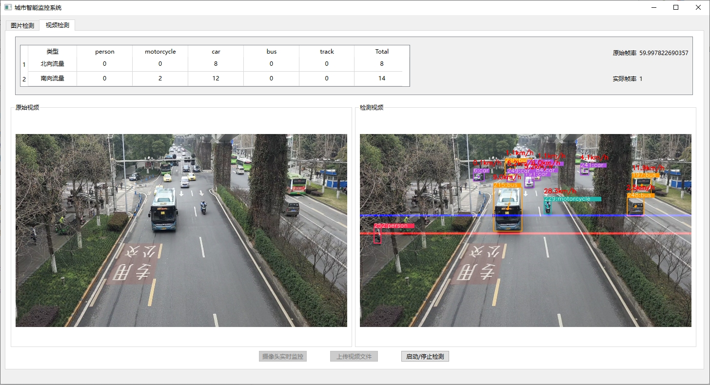

# Yolov5-DeepSORT-Object-Tracking
这是一个基于 YOLOv5 和 DeepSORT 的 PySide6 GUI 程序，用于交通目标检测和跟踪。该程序记录所定义目标的速度和交通流量，并在目标超速时显示警告信息。

**功能:**
* 支持视频、摄像头和图像检测
* 显示检测目标的类别、速度和运行轨迹
* 记录检测目标的交通流量
* 支持视频开始和停止检测
* 输出超速记录

## 安装配置
1. Python >= 3.10并且`requirements.txt`中的依赖都需要安装，其中pytorch>=2.1.2。可使用如下命令安装依赖
```bash
pip install -r requirements.txt
```
2. 下载或训练一个模型，并将权重文件放入`weights`文件夹中。也可以从 [Releases · ultralytics/yolov5 (github.com)](https://github.com/ultralytics/yolov5/releases)下载YOLOv5的权重，或直接下载[yolov5s.pt](https://drive.google.com/file/d/1GboqAYsnlnf4_XNm2Uy9uK5mnLcu21l1/view?usp=drive_link)
3. 下载Deep-SORT的权重文件[ckpt.t7](https://drive.google.com/file/d/1GcJciXMqUss4PW8tFl18vb0ctE7yjmz7/view?usp=drive_link)并将其放入 `/deep_sort/deep_sort/deep/checkpoint`中.
4. 下载MobileNet-SSD的权重文件[weight](https://drive.google.com/file/d/1A35lVW_TKQZKXRGImCjZE3gqfT9b1JDm/view?usp=drive_link) 和[prototxt](https://drive.google.com/file/d/1sznXIHi1PEj3H94Xqb0j008HRrRaCLS2/view?usp=drive_link) 文件文件用于图像检测，或选择YOLOv5作为检测器。请注意，后者需要修改代码。

**提示:**
- 可以通过修改`configs.yaml`文件修改模型配置，比如权重文件的路径.

## 运行
执行如下命令
```bash
python main.py
```

# 运行效果
#### 交通目标检测、追踪和流量统计 


# 参考
https://github.com/ultralytics/yolov5